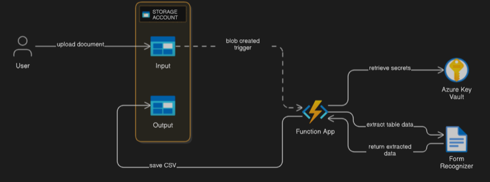
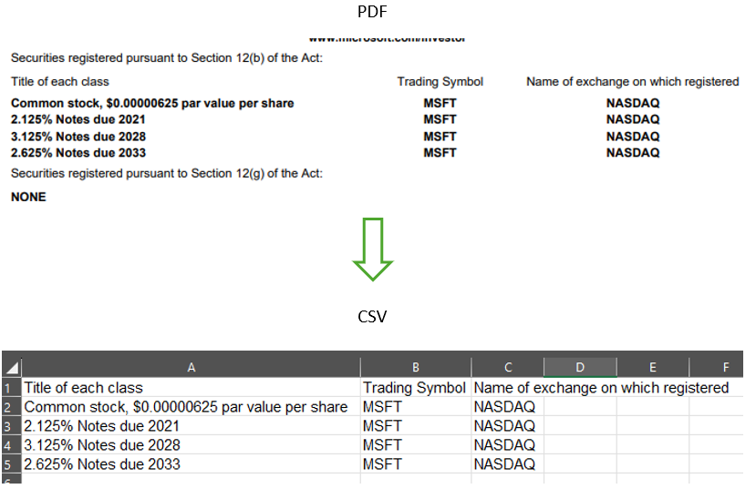

# Azure Document Intelligence Table Extraction Pipeline

This project demonstrates an end-to-end solution using Python for extracting table data from uploaded documents using Azure services. The architecture leverages Azure Storage, Azure Functions, Azure Key Vault, and Azure AI Document Intelligence (Form Recognizer), all organized within a single Azure Resource Group.

## Architecture Overview

- **Azure Storage Account**  
  - **input** container: Where users upload documents (e.g., PDFs).
  - **output** container: Where extracted table data (CSV files) is saved.

- **Azure Function App**  
  - Triggered by new blobs in the `input` container.
  - Retrieves secrets (API keys, endpoints, connection strings) securely from Azure Key Vault.
  - Sends the uploaded document to Azure Document Intelligence (Form Recognizer) for table extraction.
  - Saves the extracted table data as a CSV file in the `output` container.

- **Azure Key Vault**  
  - Stores sensitive information such as:
    - Form Recognizer endpoint
    - Form Recognizer API key
    - Storage account connection string

- **Azure AI Document Intelligence (Form Recognizer)**  
  - Analyzes documents and extracts structured table data.

- **Azure Resource Group**  
  - All resources are deployed and managed together for easier administration.

  <br />


## Workflow

1. **User uploads a document** to the `input` container in the Azure Storage Account.
2. **Azure Function App is triggered** by the new blob.
3. **Function retrieves secrets** from Azure Key Vault (using managed identity or local credentials).
4. **Function sends the document** to Azure Document Intelligence (Form Recognizer) for analysis.
5. **Extracted table data** is processed and converted to CSV format.
6. **CSV file is saved** to the `output` container in the same Storage Account.

## Prerequisites

- Azure Subscription
- Python 3.8+ and [Azure Functions Core Tools](https://docs.microsoft.com/azure/azure-functions/functions-run-local)
- [Azure CLI](https://docs.microsoft.com/cli/azure/install-azure-cli)
- (Optional) [Azurite](https://github.com/Azure/Azurite) for local storage emulation

## Setup Steps

1. **Create a Resource Group**
   ```sh
   az group create --name my-resource-group --location eastus
   ```

2. **Create a Storage Account with Two Containers**
   ```sh
   az storage account create --name mystorageaccount --resource-group my-resource-group --sku Standard_LRS
   az storage container create --account-name mystorageaccount --name input
   az storage container create --account-name mystorageaccount --name output
   ```

3. **Create an Azure Key Vault and Add Secrets**
   ```sh
   az keyvault create --name my-keyvault --resource-group my-resource-group
   az keyvault secret set --vault-name my-keyvault --name "formrecognizer-endpoint" --value "<your-form-recognizer-endpoint>"
   az keyvault secret set --vault-name my-keyvault --name "formrecognizer-key" --value "<your-form-recognizer-key>"
   az keyvault secret set --vault-name my-keyvault --name "blob-connection-string" --value "<your-storage-connection-string>"
   ```

4. **Create a Document Intelligence (Form Recognizer) Resource**
   ```sh
   az cognitiveservices account create \
     --name my-formrecognizer \
     --resource-group my-resource-group \
     --kind FormRecognizer \
     --sku S0 \
     --location eastus \
     --yes
   ```

5. **Create and Configure the Azure Function App**
   - Deploy the function code (see `__init__.py`).
   - Assign the Function App's managed identity access to Key Vault secrets.

6. **Configure Local Development (Optional)**
   - Update `local.settings.json` with your storage connection string and Key Vault URI.
   - Install dependencies:
     ```sh
     pip install -r requirements.txt
     ```

## Usage

- Upload a PDF or supported document to the `input` container.
- The Azure Function will process the file, extract tables, and save the results as a CSV in the `output` container.

## Security

- All secrets are stored securely in Azure Key Vault.
- The Function App uses managed identity for secure, passwordless access to Key Vault.

## Notes

- For local development, you can use a real Azure Storage connection string or Azurite.
- Make sure your Function App has the necessary permissions to access Key Vault and Storage.

## Result



---

**This solution provides a secure, scalable, and automated way to extract structured data from documents using Azure cloud services.**